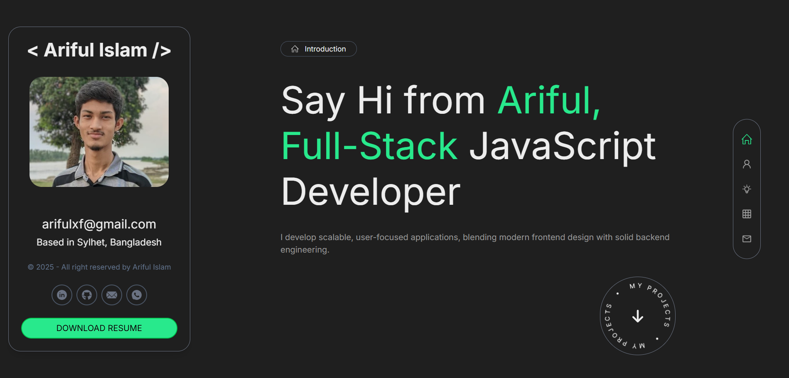

# Ariful's Portfolio

A personal portfolio website built with **Next.js** and **TypeScript** to showcase my projects, skills, and professional journey. Designed with a focus on performance, SEO, and modern UI/UX.

**Live Demo:** [ariful.tech](https://ariful.tech/)

## Tech Stack

- **Framework:** [Next.js](https://nextjs.org/) (App Router)
- **Language:** TypeScript
- **Styling:** Tailwind CSS, Motion
- **Deployment:** Vercel

## Key Features

- **Fully Responsive:** Optimized for mobile, tablet, and desktop.
- **High Performance:** Static generation (SSG) for fast load times.
- **Modern UI:** Clean and minimal design using Tailwind CSS.
- **Contact Form:** Integrated functionality to get in touch.

### Contact
Ariful Islam -Website: ariful.tech

GitHub: @ariful97768
Email: arifulxf@gmail.com

If you like this portfolio, please give it a ⭐ star!
